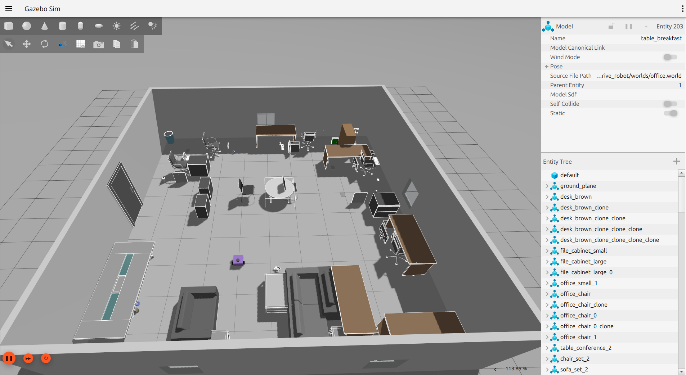
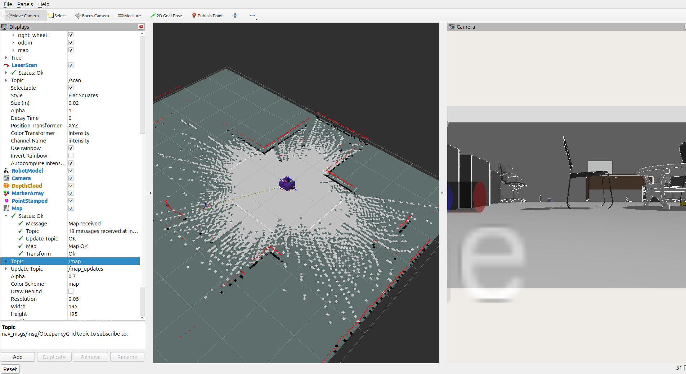

# Vision-Based Goal Navigation System



Welcome! This is a complete ROS 2 (Jazzy) autonomous navigation project featuring a differential drive robot simulated in Gazebo. The robot uses **Nav2**, **SLAM Toolbox**, and a **YOLOv8** perception pipeline to explore a room, map objects (like "chair", "table"), and autonomously navigate to them.

This guide is written specifically for **beginners** to help you run the project from scratch without missing any steps!

---

## 🛠️ 1. Prerequisites

Before starting, make sure you have a computer running **Ubuntu 24.04** with **ROS 2 Jazzy** installed.

### Install Required Dependencies
Open a terminal and run the following commands to install the necessary packages:

```bash
# Update your package list
sudo apt update

# Install ROS 2 Navigation, SLAM, and Gazebo integration packages
sudo apt install ros-jazzy-nav2-bringup ros-jazzy-slam-toolbox ros-jazzy-ros-gz -y

# Install Python packages required for the YOLOv8 object detection
pip3 install ultralytics
```

---

## 📥 2. Setting up the Workspace

In ROS 2, your code lives inside a "Workspace". Let's create one and clone the required files.

### Step 2.1: Create the Workspace
```bash
# Create a folder for your workspace named 'ak_ws', and a 'src' folder inside it
mkdir -p ~/ak_ws/src

# Navigate into the src folder
cd ~/ak_ws/src
```

### Step 2.2: Download the Code
Clone this repository into the `src` folder. *(If you already have the `diff_drive_robot` folder in `src`, you can skip this step).*
```bash
git clone https://github.com/akhiljithvg/Vision-Based-Goal-Navigation-System.git diff_drive_robot
```

### Step 2.3: Download the Gazebo 3D Models
The `office.world` environment requires a specific collection of 3D models.
```bash
# Create the hidden .gazebo directory
mkdir -p ~/.gazebo

# Clone the required models collection
cd ~/.gazebo
git clone https://github.com/mlherd/gazebo_models_worlds_collection.git
```

---

## 🚀 3. Building the Project

Before ROS 2 can run the code, it must be compiled (built) using a tool called `colcon`.

```bash
# Navigate back to the root of your workspace
cd ~/ak_ws

# Install any missing ROS dependencies automatically
rosdep update
rosdep install --from-paths src --ignore-src -r -y

# Build the workspace
colcon build --symlink-install --packages-select diff_drive_robot
```
> **Tip:** The `--symlink-install` flag means if you edit Python scripts later, you won't have to rebuild the project every time!

---

## 💻 4. Running the Simulation

Running the full project requires opening **two separate terminal windows**.

### Terminal 1: Launch the Simulation & Robot Brain
This terminal will start the Gazebo 3D world, RViz (for viewing the robot's map), the YOLO camera, and the Nav2 path planners.

```bash
# 1. Open a new terminal
# 2. Source the main ROS 2 installation
source /opt/ros/jazzy/setup.bash

# 3. Source YOUR built workspace
source ~/ak_ws/install/setup.bash

# 4. Launch everything!
ros2 launch diff_drive_robot semantic_nav.launch.py
```
**What to expect:** 
- The Gazebo window will open showing a 3D office.
- RViz2 will open showing the robot and a grid.
- **Wait about 15 seconds!** Do not type anything yet. You must wait for SLAM Toolbox to generate the initial map and Nav2 to activate.

### Terminal 2: Command the Robot
Once RViz is fully loaded and you see the laser scan dots around the robot, open a **brand new terminal window** to give the robot commands.

```bash
# 1. Open a new terminal
# 2. Source the installations again (you must do this for EVERY new terminal!)
source /opt/ros/jazzy/setup.bash
source ~/ak_ws/install/setup.bash

# 3. Run the User Interface (UI) node
ros2 run diff_drive_robot ui_node.py
```

**How to use it:**
When you see `Command>`, simply type the name of the object you want the robot to find and press **Enter**.
- **Example:** Type `chair` and press Enter.

*(Note: If you see warning messages popping up in the terminal, don't worry! Your typing is still being recorded in the background. Just type the word and hit enter).*

#### The Alternative "Clean" Method
If the terminal warnings make it too hard to type in Terminal 2, you can close it, open a clean terminal, source your workspace, and send the command directly over a ROS topic:
```bash
ros2 topic pub /ui_command std_msgs/String "{data: 'chair'}" --once
```

---

## 🧠 5. What is the Robot Doing?

1. **Wandering**: When you command it to find an object, the robot picks a random point in the room and navigates there.
2. **Scanning**: Upon reaching the point, it spins 360 degrees to scan the room with its YOLO-powered RGBD camera.
3. **Remembering**: If it sees the object (like a chair), it mathematically computes the object's GPS coordinates on the map and saves it to its "Semantic Memory".
4. **Navigating**: It immediately cancels the search, retrieves the exact coordinates from memory, and drives directly to the object!
